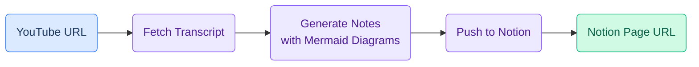

# YouTube to Notion - Claude Code Skill

A Claude Code skill that watches a YouTube video, generates intelligent structured notes with Mermaid diagrams, and writes them directly to a Notion page.


## What it does

Give it a YouTube URL and a Notion page, and it will:

1. **Fetch the transcript** from the video (with timestamps)
2. **Generate structured notes** - not a transcript dump, but dense, useful notes like a smart friend took them for you
3. **Include Mermaid diagrams** - processes, architectures, and flows are visualized as colored flowcharts that render natively in Notion
4. **Push to Notion** - creates a new child page with full formatting, headings, bullet points, code blocks, and diagrams

### Example output

Here's what the notes look like in Notion:

- TL;DR at the top
- Timestamped sections matching the video structure
- Key terms bolded on first use
- Code blocks preserved with language labels
- Colored Mermaid diagrams for any processes or flows
- "Worth noting" section with tips and caveats

## Installation

### One-liner

```bash
mkdir -p ~/.claude/skills/youtube-to-notion/scripts && \
  curl -sL https://raw.githubusercontent.com/spicypunk/youtube-to-notion-skill/main/SKILL.md -o ~/.claude/skills/youtube-to-notion/SKILL.md && \
  curl -sL https://raw.githubusercontent.com/spicypunk/youtube-to-notion-skill/main/scripts/fetch_transcript.py -o ~/.claude/skills/youtube-to-notion/scripts/fetch_transcript.py && \
  curl -sL https://raw.githubusercontent.com/spicypunk/youtube-to-notion-skill/main/scripts/create_notion_page.py -o ~/.claude/skills/youtube-to-notion/scripts/create_notion_page.py
```

### Manual

1. Clone this repo into your Claude Code skills folder:

```bash
git clone https://github.com/spicypunk/youtube-to-notion-skill.git ~/.claude/skills/youtube-to-notion
```

2. Install the Python dependency:

```bash
pip install youtube-transcript-api
```

## Setup

Before using, you need:

1. **A Notion integration token** - Create one at [notion.so/profile/integrations](https://www.notion.so/profile/integrations)
2. **A Notion page** - The page where notes will be created as children. Share this page with your integration (click "..." > "Add connections" > select your integration)

## Usage

In Claude Code, just say:

```
Take notes on this video and save to Notion:
- YouTube: https://www.youtube.com/watch?v=VIDEO_ID
- Notion page: https://www.notion.so/PAGE_ID
- Token: ntn_xxx or secret_xxx
```

Or more casually:

```
Summarize this into Notion: https://youtu.be/VIDEO_ID
```

Claude will ask for the Notion token and page if you don't provide them.

## How it works



The skill adapts its note structure based on video type:

| Video Type | Structure |
|---|---|
| Coding tutorial | Overview, Prerequisites, Step-by-step, Code snippets, Gotchas |
| Conceptual explainer | Summary, Key concepts, Mental models, Further reading |
| Tool walkthrough | What it is, Core features, How-to steps, When to use it |
| Mixed | Summary, Key takeaways, Detailed outline with timestamps |

## Requirements

- [Claude Code](https://claude.ai/claude-code) (CLI or desktop)
- Python 3.8+
- `youtube-transcript-api` (installed automatically on first use)
- A Notion integration token

## License

MIT
