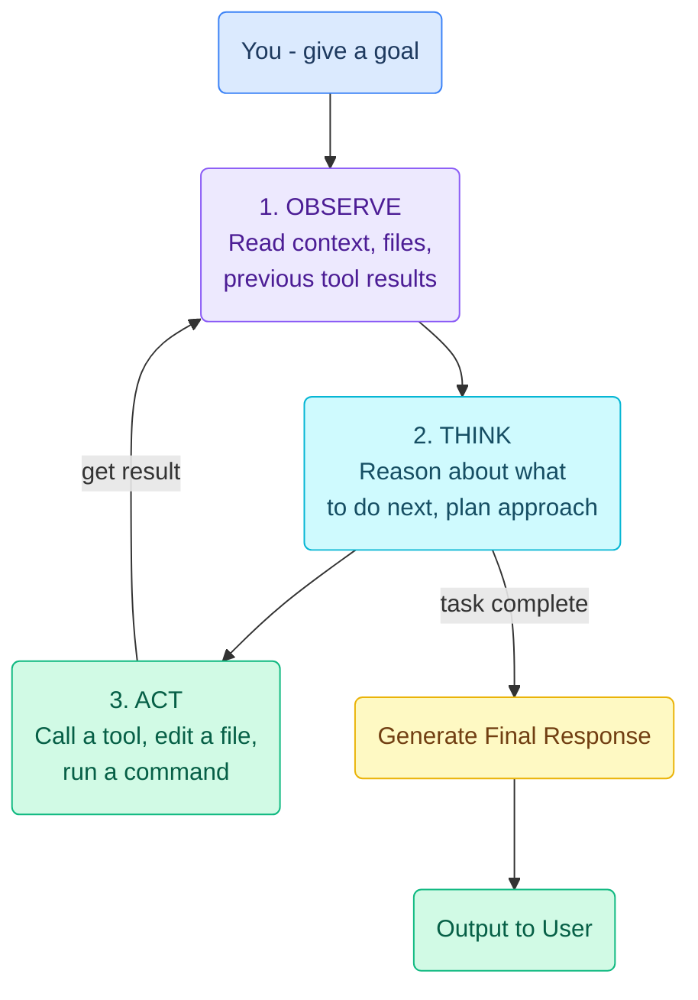

# YouTube to Notion - Claude Code Skill

A Claude Code skill that watches a YouTube video, generates intelligent structured notes with Mermaid diagrams, and writes them directly to a Notion page.


## What it does

Give it a YouTube URL and a Notion page, and it will:

1. **Fetch the transcript** from the video (with timestamps)
2. **Generate structured notes** - not a transcript dump, but dense, useful notes like a smart friend took them for you
3. **Include Mermaid diagrams** - processes, architectures, and flows are visualized as colored flowcharts that render natively in Notion
4. **Push to Notion** - creates a new child page with full formatting, headings, bullet points, code blocks, and diagrams

### Example output

Here's what the notes look like in Notion:

- TL;DR at the top
- Timestamped sections matching the video structure
- Key terms bolded on first use
- Code blocks preserved with language labels
- Colored Mermaid diagrams for any processes or flows
- "Worth noting" section with tips and caveats

## Installation

Clone this repo as your Claude Code skill. The target directory must not already exist (otherwise `git clone` will nest the repo inside it):

```bash
git clone https://github.com/spicypunk/youtube-to-notion-skill.git ~/.claude/skills/youtube-to-notion
pip install youtube-transcript-api
```

If `~/.claude/skills/youtube-to-notion` already exists, delete it first or clone elsewhere and move the files.

## Setup (one-time)

1. **Create a Notion integration** at [notion.so/profile/integrations](https://www.notion.so/profile/integrations). Copy the "Internal Integration Secret" — that's your token.

2. **Create or pick a Notion page** where new video notes will be created as child pages. On that page, click `...` → `Connections` → add your integration so it has write access.

3. **Copy `config.env.example` to `config.env`** and fill in your values:

```bash
cp ~/.claude/skills/youtube-to-notion/config.env.example ~/.claude/skills/youtube-to-notion/config.env
chmod 600 ~/.claude/skills/youtube-to-notion/config.env
$EDITOR ~/.claude/skills/youtube-to-notion/config.env
```

The file holds two values:
- `NOTION_TOKEN` — your integration secret (`ntn_...` or `secret_...`)
- `NOTION_PARENT_PAGE_ID` — the 32-char hex string from your Notion page URL (strip hyphens). Example: from `https://www.notion.so/My-Notes-336a8c1feb0680c8b74fda201bff223e?source=...`, the ID is `336a8c1feb0680c8b74fda201bff223e`.

`config.env` is gitignored — it stays on your machine and is never committed.

## Usage

Once `config.env` is set up, you only need to give Claude a YouTube URL:

```
Summarize this into Notion: https://youtu.be/VIDEO_ID
```

Claude reads the token and parent page from `config.env` automatically. To send a note to a different page just for one video, mention it explicitly:

```
Summarize this into Notion under my "Conferences" page: https://youtu.be/VIDEO_ID
```

## Example diagram output

The skill automatically generates colored Mermaid diagrams for any processes or flows discussed in the video. Here's an example from a video about AI agents:



## How it works


The skill adapts its note structure based on video type:

| Video Type | Structure |
|---|---|
| Coding tutorial | Overview, Prerequisites, Step-by-step, Code snippets, Gotchas |
| Conceptual explainer | Summary, Key concepts, Mental models, Further reading |
| Tool walkthrough | What it is, Core features, How-to steps, When to use it |
| Mixed | Summary, Key takeaways, Detailed outline with timestamps |

## Requirements

- [Claude Code](https://claude.ai/claude-code) (CLI or desktop)
- Python 3.8+
- `youtube-transcript-api` (installed automatically on first use)
- A Notion integration token

## License

MIT
