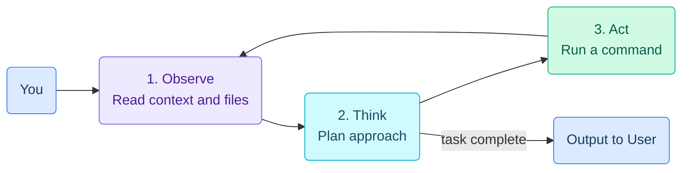

# YouTube → Notion Notes Skill

Extracts a YouTube video's transcript, generates intelligent structured notes, and writes them to a new Notion page via the Notion API.

---

## Required inputs from the user

The Notion token and parent page ID are stored in `config.env` next to this skill, so the **only** thing you need from the user is:

1. **YouTube URL** — any standard format works (`youtu.be/xxx`, `youtube.com/watch?v=xxx`)

If the user wants the note to land somewhere other than the default page, they'll say so explicitly (e.g. "save it to my Conferences page"). Otherwise, do not ask — just use the configured default.

### Loading credentials

Before running `create_notion_page.py`, source the config file so `NOTION_TOKEN` and `NOTION_PARENT_PAGE_ID` are in the environment:

```bash
set -a; source ~/.claude/skills/youtube-to-notion/config.env; set +a
```

If `config.env` does not exist (first-time use), tell the user to copy `config.env.example` to `config.env` and fill in their `NOTION_TOKEN` and `NOTION_PARENT_PAGE_ID` (see README.md). Then stop — do not prompt them inline for the token.

---

## Step 1 — Fetch the transcript

Use `bash_tool` to install the library and pull the transcript:

```bash
pip install youtube-transcript-api --break-system-packages -q
```

Then run the fetch script at `scripts/fetch_transcript.py`, passing the YouTube URL:

```bash
python scripts/fetch_transcript.py "YOUTUBE_URL"
```

The script outputs:
- `video_title` — the video title
- `transcript_text` — full transcript as a single string with timestamps

If captions are unavailable, inform the user and stop. (Future enhancement: Whisper fallback.)

---

## Step 2 — Generate notes

Analyze the transcript and produce **adaptive structured notes** — let the content dictate the format. General heuristics:

| Video type | Recommended structure |
|---|---|
| Coding tutorial | Overview → Prerequisites → Step-by-step sections → Code snippets → Gotchas & tips |
| Conceptual explainer | Summary → Key concepts (defined) → Mental models → Further reading |
| Tool walkthrough | What it is → Core features → How-to steps → When to use it |
| Mixed / unclear | Summary → Key takeaways → Detailed outline with timestamps |

**Always include:**
- A 2–3 sentence **TL;DR** at the top
- **Timestamps** for major sections (e.g. `[4:32]`)
- **Key terms** bolded on first use
- Any **code blocks** preserved verbatim with language labels
- A **"Worth noting"** section at the bottom for tips, caveats, or things the speaker emphasized

Keep the notes dense and useful — not a transcript dump, not a vague summary. Write as if a smart friend watched it and took notes for you.

**Diagrams:** When the video explains processes, loops, architectures, component relationships, decision trees, or any concept that benefits from a visual, include a **Mermaid diagram** using a fenced code block. Notion renders these as visual diagrams automatically. Example:



**Diagram style rules:**
- Use `("text")` for **rounded rectangles** (not square brackets)
- Use `<br>` for line breaks inside nodes (not `\n`), wrapped in double quotes: `("Line 1<br>Line 2")`
- Always add **color** via `classDef` and `class` — use soft pastel fills with matching darker strokes
- Suggested palette: blue `#dbeafe/#3b82f6`, purple `#ede9fe/#8b5cf6`, green `#d1fae5/#10b981`, yellow `#fef9c3/#eab308`, cyan `#cffafe/#06b6d4`, pink `#fce7f3/#ec4899`, red `#fee2e2/#ef4444`

Use the appropriate Mermaid diagram type for the content (`flowchart`, `sequenceDiagram`, `mindmap`, `graph TD`, etc.). Aim for at least one diagram per video if the content warrants it — prefer clarity over complexity.

---

## Step 3 — Write to Notion

Use `scripts/create_notion_page.py` to post the notes. With `config.env` sourced (see "Loading credentials" above), the script reads the token and parent page ID from the environment automatically. You only need to pass:

- `--title` — page title (use the video title)
- `--markdown` — path to a markdown file containing the notes

```bash
set -a; source ~/.claude/skills/youtube-to-notion/config.env; set +a
python ~/.claude/skills/youtube-to-notion/scripts/create_notion_page.py \
  --title "VIDEO_TITLE" \
  --markdown /tmp/notes.md
```

The script converts markdown to Notion blocks and creates the page. It prints the URL of the newly created page on success.

**Never echo `$NOTION_TOKEN` or include the value in any output.**

---

## Error handling

| Error | What to do |
|---|---|
| `TranscriptsDisabled` | Tell user captions are off; suggest they enable them or provide a transcript manually |
| `NoTranscriptFound` | Video may be in another language — list available languages and ask which to use |
| Notion 401 | Token is invalid or not shared with the integration |
| Notion 404 | Parent page not found — user may not have shared it with the integration |
| Notion 400 | Log the block that failed; skip it and continue rather than aborting |

---

## Security note

Never log, echo, or store the Notion token in any output file. The script reads the token from the `NOTION_TOKEN` environment variable (loaded from `config.env`); do not pass it on the command line, and do not include it in the generated notes. `config.env` is gitignored — keep it that way.
